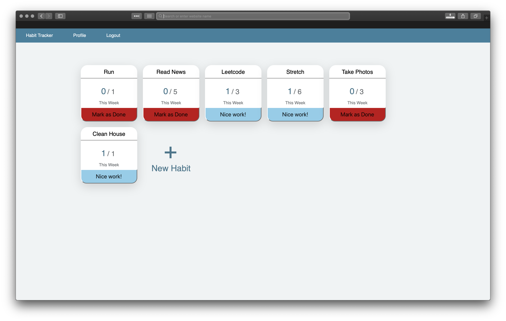

# Habit Tracking App

A habit tracking app built using Flask. Features include:
* User logins and settings
* Track habits by weekly goal
* Individual and group statistics based on habit completion.
* Dashboard to assess progress and vistual statistics

# Screenshots



# Install

```
pip install -r requirements.txt
FLASK_APP=habits.py
```


