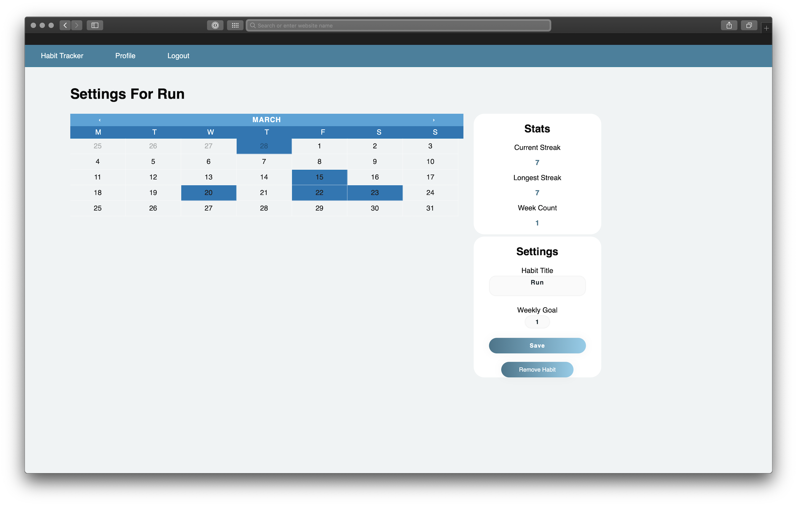

# Habit Tracking App

A habit tracking app built using Flask. This app was made for the purposes of learning flask and expanding my developer skills.  Features include:
* User logins and settings
* Track habits by weekly goal
* Individual and group statistics based on habit completion (Coming soon)
* Dashboard to assess progress and vistual statistics (Coming soon).

# Screenshots





# Install

```
python3 -m venv venv
source venv/bin/activate
pip install -r requirements.txt
npm install
FLASK_APP=habits.py
```

## To Enter Debugging Mode

```
export FLASK_ENV=development
```

# Testing

```
pytest --cov
```

# Contributing

All contributions are welcome!

